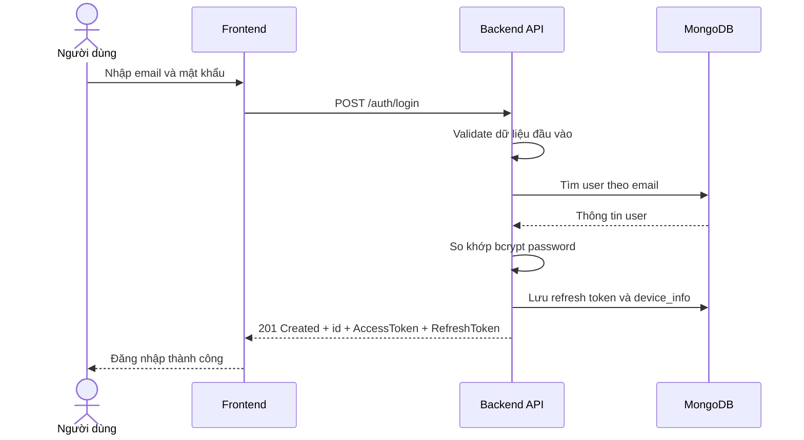

# Software Requirement Specification (SRS)
## Chức năng: Đăng nhập tài khoản (Login)

### Mermaid Sequence Diagram

**Mã chức năng:** AUTH-LOGIN-01  
**Trạng thái:** Draft / Review  
**Người soạn thảo:** Nguyễn Bá Duy Anh
**Vai trò:** Technical Writer / Developer

---

### 1. Mô tả tổng quan (Description)
Chức năng đăng nhập cho phép người dùng đã có tài khoản truy cập hệ thống bằng email và mật khẩu. API hiện tại được triển khai tại `POST /auth/login`, sử dụng cơ chế kiểm tra email và mật khẩu đã mã hóa, sau đó sinh `AccessToken` và `RefreshToken` cho phiên đăng nhập mới.

### 2. Luồng nghiệp vụ (User Workflow)
| Bước | Hành động người dùng | Phản hồi hệ thống |
| :--- | :--- | :--- |
| 1 | Truy cập màn hình đăng nhập | Hiển thị form gồm Email và Password. |
| 2 | Nhập thông tin và nhấn "Đăng nhập" | Frontend gửi request `POST /auth/login` đến back-end. |
| 3 | Hệ thống kiểm tra dữ liệu đầu vào | Validate định dạng email và độ dài mật khẩu bằng `zod`. |
| 4 | Hệ thống xác thực tài khoản | Tìm user theo email trong DataBase và so khớp mật khẩu bằng `bcryptjs`. |
| 5 | Xác thực thành công | Tạo `AccessToken`, `RefreshToken`, lưu refresh token kèm `device_info`, trả về thông tin đăng nhập thành công. |
| 6 | Xác thực thất bại | Trả lỗi `401 Unauthorized` với thông báo chung cho email hoặc mật khẩu sai. |

### 3. Yêu cầu dữ liệu (Data Requirements)
#### 3.1. Dữ liệu đầu vào (Input Fields)
* **Email:** `string`, bắt buộc, đúng định dạng email, được `trim()` và chuyển về chữ thường.
* **Password:** `string`, bắt buộc, tối thiểu `8` ký tự, tối đa `50` ký tự.

#### 3.2. Dữ liệu đầu ra (Response Data)
Khi đăng nhập thành công, hệ thống trả về:
* `status`: `success`
* `message`: `Đăng nhập thành công`
* `data.id`: ID người dùng
* `data.AccessToken`: JWT access token
* `data.RefreshToken`: JWT refresh token

#### 3.3. Dữ liệu lưu trữ / truy xuất
* **Collection `users`:** dùng để tra cứu `email`, `password`, `role`, `is_verified`.
* **Collection `refreshTokens`:** lưu `user_id`, `jti`, `device_info`, `expires_at` cho phiên đăng nhập.

### 4. Ràng buộc kỹ thuật & bảo mật (Technical Constraints)
* Validate request bằng `zod` trước khi đi vào middleware/controller.
* Mật khẩu không so sánh trực tiếp dạng plaintext, mà dùng `bcryptjs.compare()`.
* Sau khi đăng nhập thành công, hệ thống sinh 2 JWT riêng cho access token và refresh token.
* `device_info` được suy ra từ `User-Agent` của request và lưu kèm refresh token.
* Source hiện tại chưa có rate-limit riêng cho API đăng nhập.
* Source hiện tại không chặn người dùng chưa xác minh email ở bước login; trạng thái xác minh được đưa vào token để các route phía sau tự kiểm tra bằng middleware khác.

### 5. Trường hợp ngoại lệ & xử lý lỗi (Edge Cases)
* **Trường hợp:** Email sai định dạng hoặc mật khẩu không đủ độ dài.  
  * **Xử lý:** Trả `422 Unprocessable Entity` với danh sách lỗi validate.
* **Trường hợp:** Email không tồn tại trong hệ thống.  
  * **Xử lý:** Trả `401 Unauthorized` với thông báo chung "Tài khoản hoặc mật khẩu không đúng".
* **Trường hợp:** Mật khẩu không khớp với tài khoản đã tìm thấy.  
  * **Xử lý:** Trả `401 Unauthorized` với cùng thông báo chung để tránh lộ thông tin.
* **Trường hợp:** Body JSON bị lỗi cú pháp.  
  * **Xử lý:** Trả `400 Bad Request` với thông báo dữ liệu không hợp lệ.
* **Trường hợp:** Lỗi hệ thống khi truy cập database hoặc sinh token.  
  * **Xử lý:** Trả `500 Internal Server Error`.

---